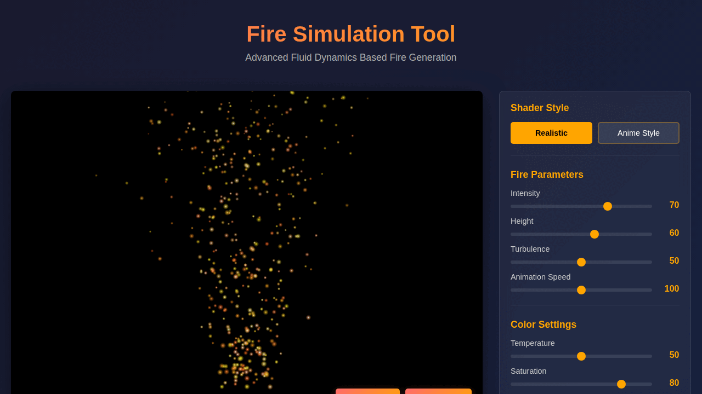
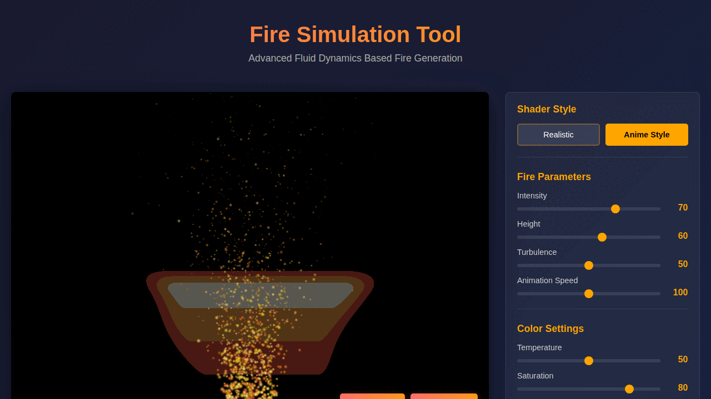

# Fire Simulation Tool

A professional-grade fire simulation tool for audiovisual production, featuring realistic fluid dynamics-based fire effects and Japanese anime-style fire rendering. Built with advanced WebGL shaders and particle systems.

## Demo

### Realistic Fire Shader


Realistic shader featuring fluid dynamics simulation with Perlin noise and fractal Brownian motion for natural flame behavior.

### Anime Style Fire Shader


Japanese anime-style shader with distinct color layers, sharp edges, and stylized movement patterns.

## Documentation

- [README](README.md) - Overview and features
- [Usage Examples](EXAMPLES.md) - Step-by-step usage guide and parameter explanations
- [Technical Documentation](TECHNICAL.md) - Architecture, API reference, and developer guide
- [License](LICENSE) - MIT License

## Features

### Dual Shader System
- **Realistic Fire Shader**: Physics-based fire simulation using fluid dynamics, fractal Brownian motion, and Perlin noise for natural flame behavior
- **Anime Style Shader**: Japanese animation-inspired fire with distinct color layers, sharp edges, and stylized movement patterns

### Advanced Particle System
- Real-time particle emission and physics simulation
- Dual particle types: Fire/Embers and Smoke
- Configurable particle count (up to 2000 particles, recommended 300-800)
- Dynamic particle size and lifetime management
- Realistic physics with turbulence and flow effects

### Export Capabilities
- PNG snapshot export
- GIF recording support (frame capture with export capability)
- Multiple format support ready for extension

### Interactive Controls
- Fire intensity adjustment
- Flame height control
- Turbulence settings
- Animation speed control
- Temperature-based color mapping
- Saturation adjustment
- Particle system configuration

## Technical Implementation

### Shader Architecture

#### Realistic Fire Shader
The realistic shader implements fluid dynamics simulation through:

- **Perlin Noise Implementation**: 3D simplex noise for organic movement
- **Fractal Brownian Motion (FBM)**: Multi-octave noise for natural turbulence
- **Temperature-based Color Gradient**: Physically accurate color transitions from dark red through orange, yellow, to white
- **Dynamic Flame Shape**: Mathematical modeling of fire behavior with width tapering and height falloff

#### Anime Fire Shader
The anime shader provides stylized rendering through:

- **Layered Color Bands**: Distinct color regions typical of Japanese animation
- **Sharp Edge Definition**: Cell-shading techniques for clean outlines
- **Stylized Motion**: Sinusoidal wave functions for characteristic anime fire movement
- **Outline Effects**: Border detection for enhanced visual separation

### Particle System

The particle system uses:
- Object pooling for performance optimization
- Physics-based motion with velocity and acceleration
- HSL color space for smooth color transitions
- Radial gradients for glow effects
- Life-based alpha fading

### Performance Optimization

- Hardware-accelerated WebGL rendering
- Efficient shader compilation and program management
- Delta time-based animation for consistent performance
- Canvas layer separation for WebGL and 2D particle rendering

## Usage

### Quick Start Guide

1. Clone or download the repository
2. Open `index.html` in a modern web browser with WebGL support
3. The fire simulation starts automatically with default settings

**First Steps:**
- Try the "Realistic" and "Anime Style" shader buttons to see different fire styles
- Adjust the **Intensity** slider to make the fire brighter or dimmer
- Change **Height** to make flames taller or shorter
- Experiment with **Particle Count** (start with 500 for balanced performance)

For detailed examples and preset configurations, see [EXAMPLES.md](EXAMPLES.md).

### Controls Overview

**Shader Selection**
- Click "Realistic" for physics-based fire simulation
- Click "Anime Style" for Japanese animation-style fire

**Fire Parameters**
- **Intensity**: Controls overall fire brightness and visibility (0-100)
- **Height**: Adjusts flame height (0-100)
- **Turbulence**: Controls chaos and movement in the flame (0-100)
- **Animation Speed**: Adjusts playback speed (0-200, where 100 is normal speed)

**Color Settings**
- **Temperature**: Shifts color palette from cool to hot (0-100)
- **Saturation**: Controls color intensity (0-100)

**Particle System**
- **Particle Count**: Number of active particles (0-2000, recommended: 300-800)
- **Particle Size**: Size of individual particles (1-10, recommended: 3-5)

**Export Functions**
- **Record GIF**: Captures frames for animation export (5-second maximum)
- **Export PNG**: Saves current frame as PNG image

**Reset**: Returns all parameters to default values

## Browser Compatibility

Requires a modern browser with WebGL support:
- Chrome 56+
- Firefox 52+
- Safari 11+
- Edge 79+

## File Structure

```
Fire/
├── index.html          # Main application HTML
├── styles.css          # Application styling
├── main.js            # Application initialization and main loop
├── shaders.js         # WebGL shader management and shader code
├── particles.js       # Particle system implementation
├── recorder.js        # Export and recording functionality
└── README.md          # Documentation
```

## API Documentation

### FireSimulation Class

Main application class managing the entire simulation.

**Constructor**: `new FireSimulation()`

**Methods**:
- `setupCanvas()`: Initializes canvas dimensions
- `setupWebGL()`: Configures WebGL context and buffers
- `setupControls()`: Binds UI event handlers
- `render()`: Renders single frame
- `animate()`: Main animation loop

### ShaderManager Class

Manages WebGL shader compilation and program management.

**Constructor**: `new ShaderManager(gl)`

**Methods**:
- `compileShader(source, type)`: Compiles GLSL shader code
- `createProgram(vertexSource, fragmentSource)`: Links shader program
- `initializeShaders()`: Compiles all shader programs
- `useShader(shaderName)`: Activates specified shader
- `setUniforms(program, uniforms)`: Updates shader uniform values

### ParticleSystem Class

Handles particle emission, physics, and rendering.

**Constructor**: `new ParticleSystem(canvas)`

**Methods**:
- `createParticle()`: Generates new particle instance
- `update(deltaTime)`: Updates particle physics
- `render()`: Draws particles to canvas
- `setMaxParticles(count)`: Adjusts maximum particle count
- `setParticleSize(size)`: Changes particle size
- `clear()`: Removes all particles

### FireRecorder Class

Manages frame capture and export functionality.

**Constructor**: `new FireRecorder(canvas)`

**Methods**:
- `startRecording()`: Begins frame capture
- `captureFrame()`: Stores current frame
- `stopRecording()`: Ends recording and processes frames
- `exportPNG()`: Exports current frame as PNG
- `downloadDataURL(dataURL, filename)`: Triggers file download

## Extension Guide

### Adding New Shaders

1. Create new fragment shader function in `shaders.js`
2. Register shader in `initializeShaders()` method
3. Add UI button for shader selection
4. Implement shader-specific parameters as needed

### Custom Export Formats

To add video or advanced GIF export:

1. Integrate external library (e.g., gif.js for GIF, MediaRecorder API for video)
2. Extend `FireRecorder` class with new export methods
3. Add UI controls for new export options

### Performance Tuning

For different hardware capabilities:
- Adjust particle count limits
- Modify shader complexity in fragment shaders
- Implement quality presets (low, medium, high)
- Add shader LOD (Level of Detail) system

## Production Use

This tool is designed for professional audiovisual production:

- **Real-time Preview**: Interactive adjustment of all fire parameters
- **High-quality Output**: Export at canvas resolution for production use
- **Flexible Styling**: Switch between realistic and stylized looks instantly
- **Reproducible Results**: Save parameter sets for consistent output

## Technical Requirements

**Minimum Requirements**:
- WebGL 1.0 compatible GPU
- 2GB RAM
- Modern browser with ES6 support

**Recommended**:
- Dedicated GPU
- 4GB+ RAM
- Chrome or Firefox for best performance

## Troubleshooting

**Fire not rendering**:
- Verify WebGL support in browser
- Check browser console for shader compilation errors
- Ensure hardware acceleration is enabled

**Poor performance**:
- Reduce particle count
- Lower animation speed
- Close other browser tabs
- Update graphics drivers

**Export not working**:
- Check browser permissions for file downloads
- Ensure sufficient disk space
- Verify canvas is rendering before export

## License

This project is available for use in commercial and non-commercial audiovisual productions.

## Version

1.0.0 - Initial Release

## Acknowledgments

Shader techniques based on established computer graphics research in fluid simulation and procedural generation.